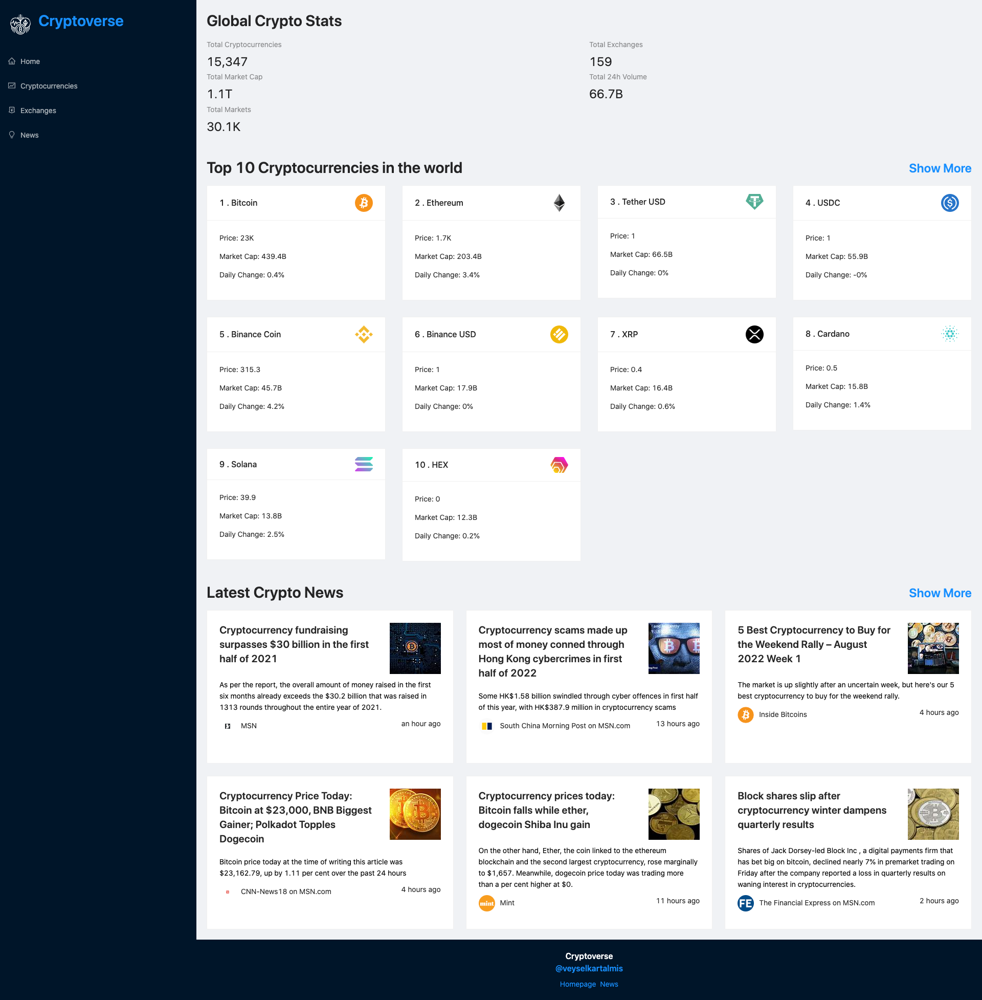

# Cryptoverse - React-Redux-API

### [Live Site](https://crypto-api-app-redux.netlify.app/)

## Features

- **Real-Time Data:** Fetches live cryptocurrency data from a reliable API.
- **Redux State Management:** Centralized state management for a predictable and scalable application.
- **Responsive Design:** User-friendly interface that works seamlessly on different devices.
- **Historical Data:** View historical prices and trends for selected cryptocurrencies.
